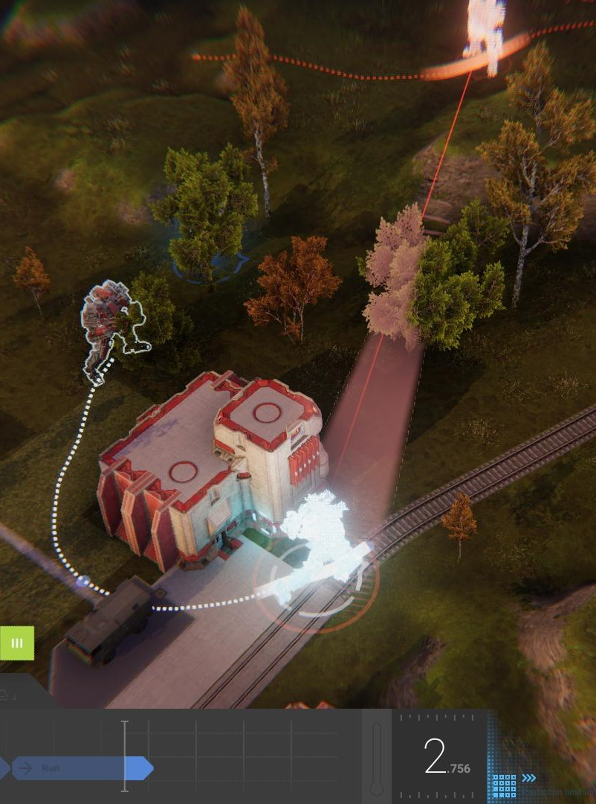

**EditRunAction**
----
A library mod for [Phantom Brigade (Alpha)](https://braceyourselfgames.com/phantom-brigade/) which enables changing the length of a run action in the timeline.

It is compatible with game version **0.20.0**. All library mods are fragile and susceptible to breakage whenever a new version is released.

Have you ever put down a run only to find that your mech has gone a couple of steps too far?

No problem! With this mod you can grab the pointy end of the action in the timeline 

and drag it left to literally walk back the run

and now your mech is safely back behind cover!

This is mostly a gimmick and only implements the basic functionality as a proof of concept. I do not recommend installing it unless you are a mod maker.

**Technical Discussion**
----
On the surface, this is a fairly simple and straightforward mod. It intercepts a handful of UI events, checks for a few conditions and if those conditions are met, switches to new logic.

However, on inspection of the new logic, you will see that it does not grab any GameObjects to manipulate as would be expected of a Unity code base. Instead, it works with values it gets from an ActionEntity. This is the telltale sign that the architecture of the game is hybrid. For UI and some other bits, it follows the standard Unity pattern of GameObjects with scripts that are called directly by Unity. For most of the game logic, it uses Entitas which is an implementation of ECS. The UI event handlers tend to act as bridges between the Unity side and the Entitas side.

This hybrid architecture creates some problems for anyone who wants to mod the code. The largest is that state and logic are scattered all over the place instead of being centralized in Entitas entities/systems and it takes a fair amount of time to chase down where it all is. Sometimes state is duplicated between an Entitas entity and another object in the system, such as when `CIViewCombatTimeline` mirrors the prediction time in its own `timeTarget` field and sets the `PredictionTimeTarget` component on `CombatEntity` with the same value. The mod maker has to figure out which one to use when.

The problem doesn't end with finding where things are. A lot of the code follows standard OOP practices of hiding the internals of objects so reflection will often be necessary to access properties and methods. Reflection, though, makes your code more verbose and harder to follow so sometimes it's better to copy the bits you want to use in the Phantom Brigade code base over to a method in your mod.

You can see I've had to deal with all of these complications even in as simple a mod as this one.